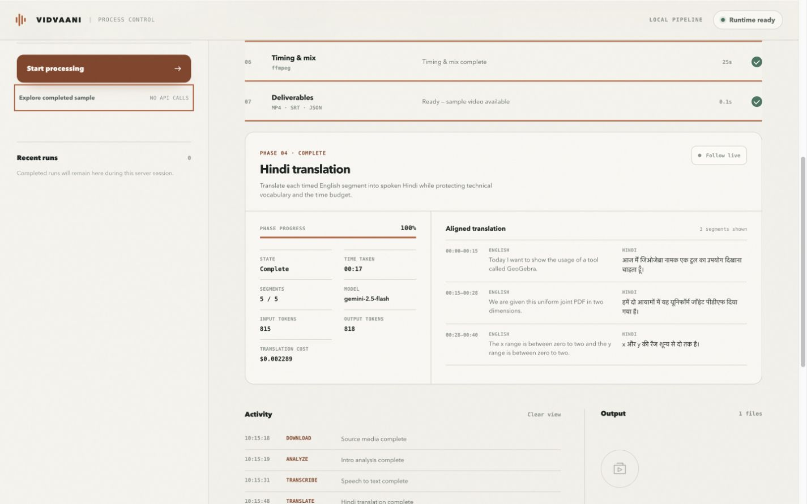

<!-- _class: title -->
<!-- _header: "" -->

OPEN-SOURCE PIPELINE · HINDI TECHNICAL LECTURES

# Technical lectures in Hindi.

VidVaani converts English technical lectures into timing-aligned Hindi audio while preserving technical vocabulary and the original video.

Nipun Batra

Computer Science &amp; Engineering · IIT Gandhinagar

July 2026 · nipunbatra.github.io/vidvaani

---

# Motivation

50,000+hours of NPTEL engineering lectures

1 commandfrom a YouTube link or local video to a Hindi dub

₹7–11measured cost for a seven-minute lecture

For many students, spoken English limits how effectively a technical lecture can be reused. The aim is a low-cost Hindi version that remains faithful to the teacher’s terminology and timing.

NPTEL catalogue and translation initiative · Measured VidVaani runs, July 2026.

---

# Limitations of existing options

PLATFORM<h2>YouTube</h2>
YouTube determines channel eligibility. Nipun’s lecture channel is not enabled. Dubs cannot be edited, and instructors cannot choose terminology or voice.

SAAS<h2>Commercial services</h2>
Typical prices are ₹3,000–11,000 per lecture, often with monthly limits and additional charges for each language.

HUMAN WORKFLOW<h2>NPTEL / Bhashini</h2>
These programmes provide careful review, but operate course by course and are not self-service tools for instructors.

> Need: a self-service system with explicit control over voice, vocabulary, timing, and cost.

YouTube eligibility and limitations: support.google.com/youtube/answer/15569972 · Vendor prices surveyed July 2026.

---

# System overview

Local STTMLX Whisper performs transcription on-device

Cacheda new voice can reuse earlier results

Measuredtime, tokens, cost and output metadata are recorded

---

# Inspecting a completed run

Each phase reports its status, elapsed time, model, cost and intermediate outputs.

---

# Translation for a technical classroom

<time>00:00–00:15</time>

ENGLISH
Today I want to show the usage of a tool called GeoGebra.

HINDI
आज मैं जियोजेब्रा नामक एक टूल का उपयोग दिखाना चाहता हूँ।

<time>00:28–00:40</time>

ENGLISH
The x range is between zero to two and the y range is between zero to two.

HINDI
x और y की रेंज शून्य से दो तक है।

Terms such as <strong>GeoGebra, x, y and PDF</strong> are retained. The explanation is translated into natural spoken Hindi.

---

# Timing and assembly

Each translation receives a word budget. After synthesis, the clip is trimmed and its pace is adjusted; original audio remains in the gaps.

---

# Demo runs stop at the requested segment

5requested segments

58.5 sfinal duration, with no English remainder

1864×1080source resolution preserved

Demo mode ends after the last generated Hindi clip. Full mode processes the complete source. The original video stream is copied without reducing its resolution.

<pre><code>uv run --frozen vidvaani-web
# “Explore completed sample” makes no API calls</code></pre>

---

# Measured time and cost

2½–4 minend-to-end for a seven-minute lecture

₹80–110extrapolated per lecture-hour

₹0for a cached no-API demo run

---

# Cloud and local speech options

CLOUD<h2>Sarvam</h2>
Clear Hindi with Indian prosody and several voice choices. This is the default demonstration backend.

CLOUD<h2>Gemini TTS</h2>
Natural delivery and style control, although its Hindi accent may sound less local.

LOCAL · ₹0<h2>Gemma 4 + Qwen3-TTS</h2>
Translation and speech run on-device. Lecturer voice cloning is used only with consent.

59 sGemma 4 31B translation on the 58 s clip

1.6× RTFQwen3-TTS cloned speech generation

0.89best consented speaker similarity; STT-checked

Experimental local chain: experiments/local_prob/step1_transcribe.py → step4_assemble.py · Method and results: docs/local-models.md.

---

# Demonstrations

NIPUNBATRA.GITHUB.IO/VIDVAANI

## Available comparisons

- Original English beside the Hindi result
- Sarvam, Gemini, fully local, and cloned-voice paths
- Short probability demo plus a full NPTEL lecture
- Methods, costs, privacy and limitations documented alongside the examples

The website supports audio comparison; the control room shows how each output was produced.

---

# Limitations and next steps

QUALITY<h2>Faculty review</h2>
The system produces a draft; subject experts must still review its pedagogical accuracy.

ALIGNMENT<h2>Dense passages</h2>
Some segments require a shorter translation rather than faster synthesized speech.

TRUST<h2>Voice consent</h2>
Voice cloning is opt-in, and speaker similarity alone is not sufficient for release.

Next steps are faculty-in-the-loop editing, a terminology glossary, native TTS pace control, support for more Indian languages, and evaluation of student comprehension.

---

<!-- _class: close -->
<!-- _header: "" -->

VIDVAANI

# From an English lecture to a Hindi version.

The pipeline is open, its intermediate results can be inspected, and the translation and speech stages can run locally when required.

Demonipunbatra.github.io/vidvaani

Codegithub.com/nipunbatra/vidvaani

QuestionWhich lecture should be evaluated next?

