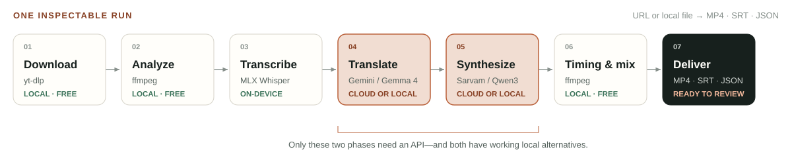
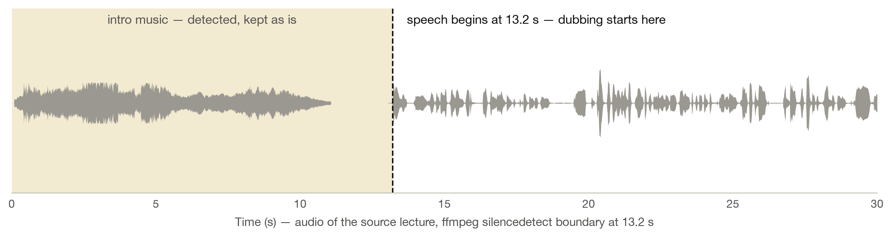
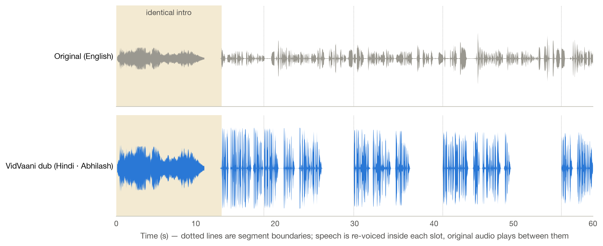
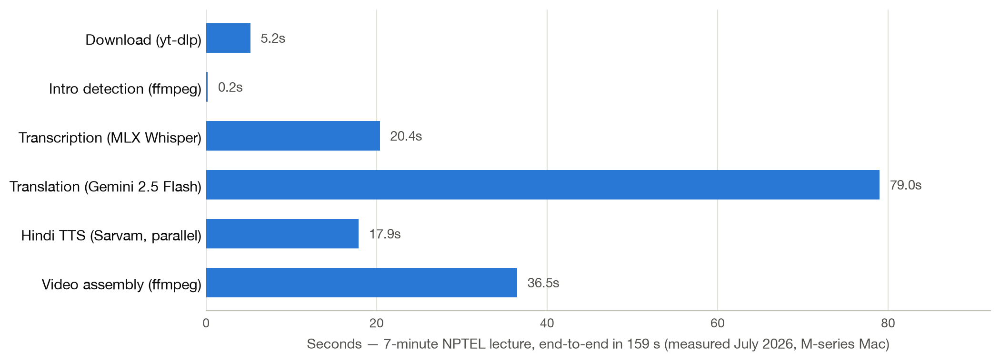
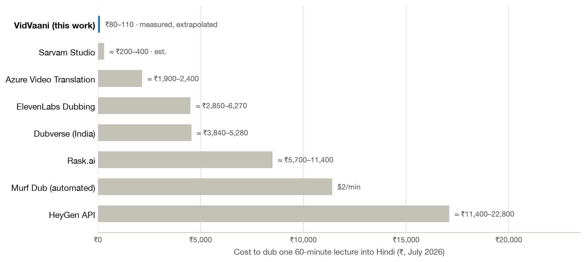
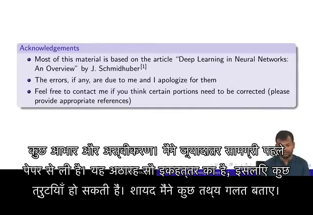

<!-- _class: title -->
<!-- _header: "" -->

# VidVaani

<p class="subtitle">Automated, low-cost dubbing of English technical lectures into Hindi</p>

<p class="author">Nipun Batra</p>
<p class="affil">Computer Science &amp; Engineering, IIT Gandhinagar</p>

<p class="date">July 2026 · github.com/nipunbatra/vidvaani · nipunbatra.github.io/vidvaani</p>

---

# The problem: technical education is locked in English

- India's best engineering lectures — NPTEL alone hosts **50,000+ hours** — are overwhelmingly in English.
- A large fraction of our students think and learn in Hindi and other Indian languages; a fast English lecture is a barrier, not a resource.
- **NEP 2020** explicitly calls for higher education content in Indian languages.
- Manual dubbing is slow and expensive: NPTEL's human-verified translation effort has taken years to cover a subset of courses in 11 languages.

> **Goal:** given any lecture video, produce a natural-sounding Hindi version in minutes, for rupees — with the technical vocabulary students actually use.

<div class="foot">NPTEL translation initiative: nptel.ac.in/translation · Bhashini (MeitY) has dubbed ~200 NPTEL/SWAYAM courses in 8 languages via human-in-the-loop workflows.</div>

---

# Existing options do not fit the lecture use case

| Option | Cost | Why it falls short |
|---|---|---|
| YouTube auto-dubbing | Free | Only the **channel owner** can enable it; dubs are uneditable; no control over voice or terminology; widely criticised as robotic |
| Commercial dubbing SaaS (ElevenLabs, Rask, HeyGen, Dubverse, Murf) | **₹3,000–11,000 per lecture** | Priced for short marketing clips; monthly minute caps; each extra language billed again |
| Azure Video Translation | ≈ ₹2,000 per lecture | Cheapest managed option, but limited voice choice and no terminology control |
| NPTEL / Bhashini human pipelines | Government-funded | High quality but slow, course-by-course; not self-serve |

**The gap:** a self-serve tool an instructor can point at *any* video, with control over voice and vocabulary, at commodity API prices.

<div class="foot">Pricing surveyed July 2026 from official pages (elevenlabs.io/pricing, rask.ai/pricing, heygen.com, dubverse.ai/pricing, azure.microsoft.com/pricing/details/speech). 1 USD = ₹95.4.</div>

---

# VidVaani: a six-stage open pipeline



- Single command: `vidvaani dub <URL> --full -b sarvam -v abhilash`
- Transcription runs **on-device** (MLX Whisper on Apple Silicon) — audio never leaves the machine until translation.
- Every intermediate artifact is cached: re-dubbing with a new voice skips download, transcription, and translation.

The next five slides walk **one real lecture** — NPTEL CS7015 Lecture 1.1 (Prof. Mitesh Khapra, IIT Madras, 7 min) — through every stage.

---

# Steps 1–2 — Download, and find where speech starts

`yt-dlp` fetches any YouTube URL or local file — no allowlist, no channel ownership needed. Then `ffmpeg silencedetect` locates the boundary between intro music and speech:



The music is **not dubbed over** — it is kept exactly as published, and dubbing begins on the first spoken word.

---

# Step 3 — Transcribe on-device

MLX Whisper (`distil-large-v3`) runs locally on Apple Silicon — the audio never leaves the machine. Output: time-stamped English segments, grouped to ≤ 15 s:

| Time | Whisper output (verbatim) |
|---|---|
| 18.6 – 29.9 s | "In today's lecture is going to be a bit non-technical. We are not going to cover any technical concepts…" |
| 29.9 – 41.1 s | "So, we hear the terms artificial neural networks, artificial neurons quite often these days…" |
| 41.1 – 56.0 s | "And this history contains several spans across several fields, not just computer science…" |

Transcribing the full 7-minute lecture took **17–20 s** (measured) — and it is free.

<div class="foot">Rows taken verbatim from the pipeline's transcript file (4TC5s_xNKSs_transcript_en.json), July 2026. Note Whisper keeps the speaker's actual phrasing, including slips.</div>

---

# Step 4 — Translate for the clock, and the classroom

Constraints in the translation prompt: *speakable in the same duration; conversational (not literary) Hindi; technical terms stay in English.*

| | Original (English) | VidVaani (Hindi) |
|---|---|---|
| 13.2 s | "Hello everyone, welcome to lecture 1 of **CS7015** which is the course on **deep learning**." | "सभी को नमस्कार, **CS7015** के लेक्चर एक में आपका स्वागत है, जो **डीप लर्निंग** का कोर्स है।" |
| 29.9 s | "…we hear the terms **artificial neural networks**, artificial neurons quite often these days." | "…आजकल हम आर्टिफिशियल न्यूरल नेटवर्क्स, आर्टिफिशियल न्यूरॉन्स शब्द अक्सर सुनते हैं।" |

Students say *gradient* and *neural network* — a dub that renders them as प्रवणता and तंत्रिका जाल (as fully-literal systems do) sounds foreign to the very audience it serves.

<div class="foot">Rows taken verbatim from a pipeline run on NPTEL CS7015 Lecture 1.1 (Prof. Mitesh Khapra, IIT Madras), July 2026.</div>

---

# Step 5 — Synthesize, and fit the clock

Hindi runs ~15–35% longer than English. Per segment, following the automatic-dubbing literature:

1. The translator gets a **word budget** per slot (2.4 words/s, calibrated against the TTS voice's measured 2.8 words/s delivery) — fixing length at translation time beats stretching audio afterwards.
2. Synthesize at natural pace, trim trailing silence, measure with `ffprobe`.
3. If it fits (±5%) — done. Otherwise speed-adjust with an **asymmetric clamp (0.95×–1.35×)**: listeners tolerate faster speech far better than slowed speech.
4. Still too long? The clip **spills into the trailing pause** rather than being cut — professional dubs sacrifice timing, never content.
5. During pauses, the **original soundtrack plays** — atmosphere and intro music survive the dub.

In the latest run of the example lecture, **all 33 segments fit their slots** — the word budget does most of the work before any audio adjustment is needed.

<div class="foot">Design informed by the dubbing literature: Federico et al. 2020 (arXiv:2001.06785), Virkar et al. 2022 (arXiv:2204.02530), "Dubbing in Practice" TACL 2023 (arXiv:2212.12137). Details: docs/timing-alignment.md in the repo.</div>

---

# Step 6 — Reassemble: the result, seen in the signal



The intro is bit-identical to the source; every Hindi utterance starts on its original segment boundary; between utterances the original soundtrack plays. Plus a Hindi `.srt`, and optionally subtitles burned into the frame.

<div class="foot">First 60 s of NPTEL CS7015 Lec 1.1 and its dub, from the July 2026 run shown on the demo page.</div>

---

# Measured performance — faster than real time



A **7-minute lecture dubs in 2½–4 minutes** end-to-end on a laptop — the bottleneck is the translation API, not synthesis. Re-runs with a different voice take under a minute (cached transcript + translation).

<div class="foot">Fresh run shown, NPTEL CS7015 Lec 1.1 (417 s video, 33 segments), Sarvam backend, Apple Silicon, July 2026. A second fresh run totalled 242 s — the spread is translation-API latency.</div>

---

# Measured cost — rupees, not lakhs

Measured on the same 7-minute lecture (5,307 Hindi characters):

| | Translation | Hindi TTS | Total (7 min) | Extrapolated, 1 hour |
|---|---|---|---|---|
| Sarvam `bulbul:v2` | ₹1.4 | ₹8.0 | **₹9.4** ($0.10) | ≈ ₹80 |
| Gemini 2.5 Flash TTS | ₹1.4 | ₹9.6 | **₹11.0** ($0.12) | ≈ ₹95 |
| Edge TTS (free tier) | ₹1.4 | ₹0 | **₹1.4** | ≈ ₹12 |

- A full **40-lecture course ≈ ₹3,200–4,400** — less than one SaaS-dubbed lecture.
- Costs measured by the pipeline itself from API-reported token counts, at official July 2026 prices.
- Stable across runs: after calibrating the translation word budget, the same lecture re-ran at **₹7.9**.

<div class="foot">Sarvam: ₹15/10,000 chars (docs.sarvam.ai). Gemini TTS: $0.50/1M text + $10/1M audio tokens; translation $0.30/$2.50 per 1M (ai.google.dev/gemini-api/docs/pricing). 1 USD = ₹95.4.</div>

---

# Where this sits in the market



<div class="foot">Midpoints of published prices, single target language, July 2026. YouTube auto-dubbing is free but channel-owner-only with no editorial control. Papercup/RWS (human-in-loop enterprise) quotes custom prices well above this scale.</div>

---

# Why not just use the platforms?

<div class="cols">
<div>

## YouTube auto-dubbing
- Now rolled out to all channels — **but only the uploader** can enable it.
- A university cannot dub NPTEL or MIT content it does not own.
- Dubs cannot be edited — a mistranslated technical term can only be unpublished, not fixed.

</div>
<div>

## Sarvam Studio &amp; SaaS dubbers
- Produce formal, fully-translated Hindi (क्षेत्रफल for "area") — jarring for STEM learners used to Hinglish.
- No control over segment-level phrasing or terminology.
- VidVaani uses the **same Sarvam voices** with full editorial control, at API prices.

</div>
</div>

> Notably, the popular open-source dubbing tools (pyvideotrans ★18k, VideoLingo ★17k) integrate **no Indian-language TTS at all** — VidVaani fills a real gap.

---

# What a run looks like

```text
$ vidvaani dub "https://youtube.com/watch?v=4TC5s_xNKSs" --full -b sarvam -v anushka

  Downloaded: Deep Learning(CS7015): Lec 1.1 Biological Neuron
  Transcribed: 33 segments          Generated subtitles: 4TC5s_xNKSs_hindi.srt
  TTS: 33/33 segments (parallel)    Created: 4TC5s_xNKSs_hindi_anushka.mp4

            Timing Breakdown                        API Costs
  Download          5.2s    3.3%          Translation   9,542 tokens   $0.015
  Transcription    20.4s   12.8%          TTS (Sarvam)  5,307 chars    Rs 7.96
  Translation      79.0s   49.6%          Total                        Rs 9.4
  TTS Generation   17.9s   11.2%
  Video Assembly   36.5s   22.9%
  Total           159.2s    100%
```

Every run reports its own timing and cost — the numbers on the previous slides are this output, not estimates.

---

# Demonstrations

<div class="cols">
<div>

**nipunbatra.github.io/vidvaani** — plays in any browser:

1. **58-second calculus clip, eight ways** — original, Sarvam and Gemini voices (same translation, so the comparison is purely the voice), plus Sarvam's own Dashboard output.
2. **Full 7-minute NPTEL lecture** — original beside Hindi dub; intro music preserved; five voices; burned-in subtitles.

What to listen for:

- Technical terms stay in English (*deep learning*, *CS7015*).
- Pauses land where the professor pauses.
- Native Indian prosody (Sarvam) vs. slight Western accent (Gemini).

</div>
<div>


<p class="cap">Dubbed lecture with generated Hindi subtitles burned in.</p>


<p class="cap">Scan to open the demo page.</p>

</div>
</div>

---

# Honest limitations

- **No human review loop yet** — NPTEL's own effort treats faculty verification as essential for pedagogy; ₹80/lecture buys the draft, not the sign-off.
- **Timing fit is still partly post-hoc** — word budgets plus a 0.95–1.35× speed clamp handle most segments, but very dense passages can still sound hurried (see next slide).
- Gemini TTS models are **preview** — pricing and behaviour may change; Edge TTS is an unofficial free endpoint, fine for prototyping only.
- No lip-sync. Voice cloning of the original lecturer now works locally (next slide) and stays gated on **consent** — the one published cloned demo is the author's own voice on his own lecture.
- Hindi first; Sarvam voices cover 11 Indian languages, so extension is natural.

---

# Towards a fully local pipeline

Every cloud stage now has a working local, open-weights replacement — measured on the 58 s demo clip, Apple Silicon, July 2026:

| Stage | Cloud (current) | Local (experimental) | Measured, local |
|---|---|---|---|
| Transcribe | — (already local) | MLX Whisper | 17–20 s per 7-min lecture |
| Translate | Gemini 2.5 Flash | **Gemma 4 31B** (MLX 4-bit, Apache-2.0) | 59 s for the clip (12B via ollama: 25 s) |
| Hindi speech | Sarvam API | **Qwen3-TTS 1.7B** (MLX, Apache-2.0) | **1.6× real time**, cloned (first run: ~4×) |

- The "Fully local" demo card was produced this way — **₹0 per lecture, nothing leaves the machine**; at RTF 1.6 a 1-hour lecture ≈ a 2–2.5 h batch.
- **Voice cloning is now on the demo page**: the "Your own voice" card clones the author from 28 s of his English in the clip itself and speaks the Hindi dub in his voice — published with consent, since it is his own lecture (word-perfect STT round-trip, ~3 min end-to-end for the 58 s clip).
- Indic-specialised alternatives (AI4Bharat IndicF5, Chatterbox-hi) may beat Qwen3-TTS on Hindi naturalness; evaluation ongoing (see `docs/local-models.md`).

---

# Cloning the lecturer's voice: five rungs in one day

Similarity = ECAPA cosine to the lecturer's real voice. His own recordings score **0.93** against each other (the ceiling); other voices score **~0.3**. All measured 12 Jul 2026.

| Rung | Method | Compute | Dub similarity |
|---|---|---|---|
| 1 | Single take, ICL cloning from a 28 s reference | laptop, 95 s | 0.76 |
| 2 | Best-of-16 search (4 curated refs × temp × seed), scored + stitched | laptop, ~45 min | 0.85 |
| 3 | + LoRA fine-tune, rank 16 on 30 min of his verified speech | laptop (MLX), **7.5 min training** | 0.86 |
| 4 | + official full SFT, community-corrected LR | lab A100, **~3 min training** | 0.89 |
| 5 | + **175-min dataset** (18 videos speaker-verified, 1,777 gated utterances), 3-LR sweep on 3 A100s, restored speaker encoder | lab A100s, minutes per run | **0.89** — best takes 0.83–0.87 |

**What actually mattered** — in order: reference choice → fine-tuning on verified data → *early stopping* (epoch 0 won in **every** variant) → restoring the speaker-encoder weights the official SFT silently drops from checkpoints. Rungs 4–5 need the GPU tier (≈ ₹5 lakh workstation or a lab server); rungs 1–3 are a laptop.

**And the guard-rail that made it publishable**: an STT round-trip on every take. It caught the LoRA silently deduping a repeated clause, and the single highest-similarity take of the project being fluent gibberish in his voice. Similarity alone is never a release criterion.

---

# Roadmap: smarter time alignment

We surveyed the automatic-dubbing literature (Amazon, Microsoft, IIT Madras, IWSLT) and re-based the alignment design on it — full notes in `docs/timing-alignment.md`:

**Already implemented** — word budgets in the translation prompt; asymmetric speed clamp; spill-into-pause instead of truncation; trailing-silence trimming.

**Next:**

1. **TTS-native pace instead of waveform stretching** — Sarvam exposes `pace` (0.3–3.0×); synthesis at the right speed beats resampling in every published comparison.
2. **Re-translate outliers once** — segments still needing > 1.3× speed get one "shorten by 25%" LLM pass; ~25% of En→Hi segments are expected to qualify.
3. **Sentence-boundary segmentation** with word-level timestamps (≈ +4.5 BLEU over blind packing).
4. **Terminology glossary** carried across translation batches for consistency.
5. **Evaluation study** — student MOS ratings and comprehension quizzes, Hindi dub vs. English original.

---

# Summary

<br>

- **Any lecture → natural Hindi dub in minutes**: one command, six automated stages, technical vocabulary preserved.
- **Measured, not estimated**: a 7-min lecture in ~3 minutes for under ₹10; ≈ ₹80–110 per lecture-hour; a 40-lecture course for the price of a textbook.
- **20–100× cheaper** than commercial dubbing platforms, with editorial control none of them offer.
- Open source (MIT): **github.com/nipunbatra/vidvaani**
- Live demos: **nipunbatra.github.io/vidvaani**

<br>

> Next: faculty-in-the-loop review, more Indian languages, and a student comprehension study.
