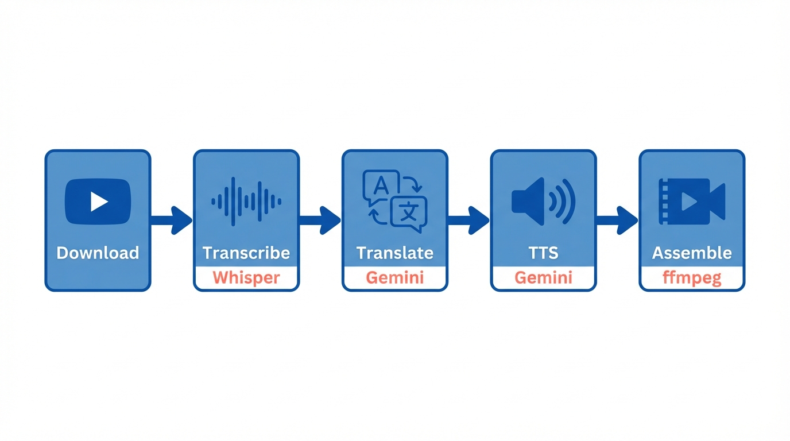
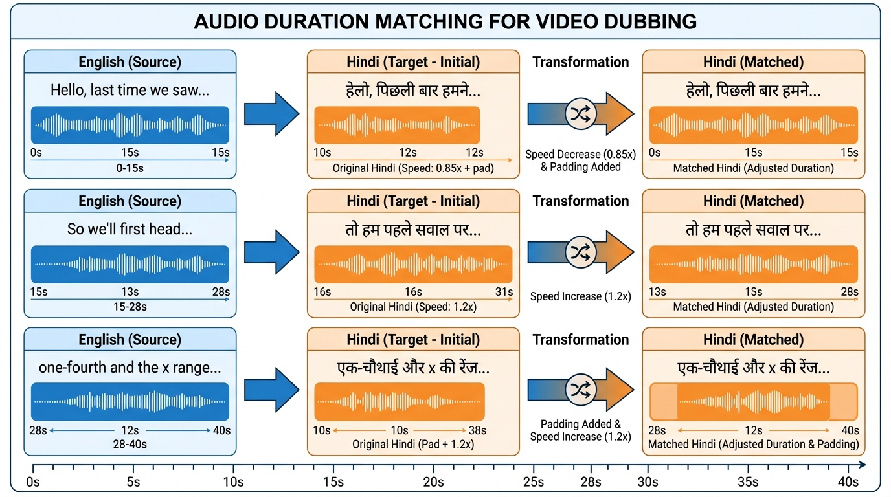

<!-- _class: title-slide -->

# yt-hindi
## Automated YouTube to Hindi Dubbing Pipeline

**Nipun Batra**
*IIT Gandhinagar*

---

# Pipeline Overview



<div class="insight">

**Key Stack:** yt-dlp → MLX-Whisper → Gemini 2.0 Flash → Sarvam AI / Gemini TTS → ffmpeg

</div>

---

# Demo: NPTEL Deep Learning

**Source:** Prof. Mitesh Khapra, IIT Madras — Lecture 1.1 Biological Neurons (7 min)

<div class="columns">
<div>

**Original Video:**
- English lecture
- 10s intro music
- Technical content

</div>
<div>

**Hindi Dubbed:**
- Auto intro detection (13.2s)
- Preserves terminology
- Multiple voice options

</div>
</div>

<div class="example">

**Features:** Auto intro detection, non-speech preservation, SRT subtitles, burned-in subtitles option

</div>

---

# Real Translation Example

| Time | English | Hindi |
|------|---------|-------|
| 0:18 | "Hello everyone, welcome to lecture 1 of CS7015, which is the course on deep learning." | "हेलो एवरीवन, CS7015 लेक्चर एक में आपका स्वागत है, जो डीप लर्निंग का कोर्स है।" |
| 0:28 | "In today's lecture is going to be a bit non-technical..." | "आज का लेक्चर थोड़ा नॉन-टेक्निकल होगा..." |

<div class="example">

**Preserves:** Course codes (CS7015), technical terms (deep learning), natural Hindi phrasing

</div>

---

# Auto Intro Detection

**Problem:** Videos often have intro music before speech starts

**Solution:** Automatic detection using ffmpeg silence analysis

```
NPTEL Deep Learning video structure:
├── 0.0s - 10.7s    → Intro music (preserved)
├── 10.7s - 13.2s   → Silence/pause (preserved)
└── 13.2s onwards   → Speech starts (Hindi dubbing begins)
```

<div class="insight">

Pipeline auto-detects and preserves intro music. Use `--intro-offset 0` to disable.

</div>

---

# Non-Speech Preservation

<div class="columns">
<div>

**Keeps original audio during:**
- Intro/outro music
- Pauses between sentences
- Background sounds

</div>
<div>

**During speech segments:**
- Original audio muted
- Hindi TTS overlaid
- Smooth crossfades

</div>
</div>

<div class="realworld">

Result: Natural-sounding output that preserves the video's atmosphere

</div>

---

# Text-to-Speech Options

<div class="columns">
<div>

**Sarvam AI** (Native Indian)
- Abhilash, Karun, Hitesh (male)
- Vidya, Anushka, Manisha (female)
- Rs 1.5/1K chars
- Native Hindi prosody

</div>
<div>

**Gemini TTS**
- Charon, Fenrir (male)
- Kore, Aoede (female)
- $0.004/1K chars
- Excellent quality, 4x cheaper

</div>
</div>

<div class="example">

**Edge TTS:** Free option with Madhur/Swara voices — good for testing

</div>

---

# Duration Matching



<div class="example">

**Strategy:** Adjust speed (0.85x–1.25x) to preserve natural sound, then pad/trim to match exactly

</div>

---

# Subtitle Support

**Auto-generates Hindi SRT files**

```srt
1
00:00:18,559 --> 00:00:28,879
आज का लेक्चर थोड़ा नॉन-टेक्निकल होगा।

2
00:00:28,879 --> 00:00:41,060
तो, आजकल हम आर्टिफिशियल न्यूरल नेटवर्क...
```

**Burn into video:** `yt-hindi burn-subs video.mp4 subs.srt --position bottom_bar`

<div class="insight">

Subtitles in black bar below video — doesn't obscure content

</div>

---

# Cost Estimate

| Video Length | Translation | Sarvam TTS | Gemini TTS | Total |
|--------------|-------------|------------|------------|-------|
| 7 min | ~$0.001 | ~$0.09 | ~$0.04 | **$0.04–0.09** |
| 20 min | ~$0.002 | ~$0.25 | ~$0.10 | **$0.10–0.25** |
| 80 min | ~$0.005 | ~$1.00 | ~$0.30 | **$0.30–1.00** |

<div class="columns">
<div>

**40-lecture course:**
- Gemini: **$12–15**
- Sarvam: **$40–50**

</div>
<div>

**Processing time:**
- 7 min video → ~2 min
- Parallel TTS + caching

</div>
</div>

---

# Key Features

| Feature | Description |
|---------|-------------|
| **Auto Intro Detection** | Preserves intro music automatically |
| **Non-Speech Preservation** | Keeps pauses and background natural |
| **Translation Caching** | Generate multiple voices without re-translating |
| **TTS Caching** | Resume failed runs without regenerating |
| **SRT Generation** | Auto Hindi subtitles, can burn into video |
| **Cost Tracking** | Real-time API cost display |

---

# CLI Usage

```bash
# Quick demo (first 5 segments)
yt-hindi dub "https://youtube.com/watch?v=..."

# Full video with Sarvam voice
yt-hindi dub URL --full -b sarvam -v abhilash --title-folder

# Multiple voices (translation cached)
yt-hindi dub URL --full -b sarvam -v karun
yt-hindi dub URL --full -b gemini -v Charon

# Burn subtitles
yt-hindi burn-subs video.mp4 subs.srt --position bottom_bar
```

---

<!-- _class: section-divider -->

# Try It

`uv run yt-hindi dub "https://youtube.com/..." --full --title-folder`

**Demo page:** `open demo.html`

github.com/nipunbatra/yt-hindi
